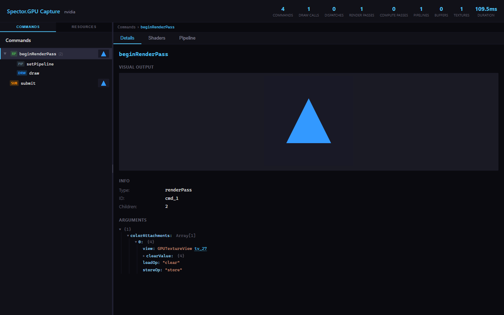

# Spector.GPU

**Capture and inspect WebGPU frames in Chrome, Edge, or an AI debugging workflow.**

[](https://github.com/sebavan/Spector.gpu/actions/workflows/ci.yml)
[](https://github.com/sebavan/Spector.gpu/releases/latest)
[](LICENSE)
[](src/extension/manifest.json)

Spector.GPU is the WebGPU-era successor to [Spector.js](https://github.com/BabylonJS/Spector.js). It records a frame's command hierarchy, shaders, pipelines, bind groups, buffers, textures, and visual outputs without requiring changes to the inspected application.

> **Project status:** Stable (`1.x`). Capture format 1 and the documented MCP tool contracts follow the [compatibility policy](COMPATIBILITY.md).



## Highlights

- One-click frame capture with submit, render-pass, compute-pass, draw, and dispatch hierarchy
- Texture previews, cubemap faces, buffer readback, hex dumps, and an interactive 3D mesh view
- WGSL shader viewer/editor and complete render/compute pipeline inspection
- Resource browser with command-to-resource cross-references and browser history
- Stateful [MCP server](mcp/README.md) for agent-driven capture and analysis
- Manifest V3 extension with local-only capture storage and no telemetry

## Install the extension

### From a release

1. Download `spector-gpu-<version>.zip` from the [latest GitHub release](https://github.com/sebavan/Spector.gpu/releases/latest).
2. Unzip it.
3. Open `chrome://extensions/` in Chrome or `edge://extensions/` in Edge.
4. Enable **Developer mode**, choose **Load unpacked**, and select the unzipped folder.

The extension is not currently distributed through the Chrome Web Store.

### From source

```bash
git clone https://github.com/sebavan/Spector.gpu.git
cd Spector.gpu
npm ci
npm run build
```

Load the generated `dist/` directory as an unpacked extension.

## Capture a frame

1. Open a WebGPU application, such as the [Babylon.js Playground](https://playground.babylonjs.com/?iswebgpu=true).
2. Wait for the extension icon to show the blue **GPU** badge.
3. Open the extension and choose **Capture Frame**.
4. Inspect the capture in the result viewer that opens automatically.

Captures can include application shaders, GPU resource contents, labels, and screenshots. They remain in local extension storage until deleted from the result viewer or browser settings; see [Privacy](PRIVACY.md) for the complete data-handling and permission explanation.

### 30-second walkthrough

In the result viewer, expand a render pass to select a draw, then use **Shaders** and **Pipeline** to inspect its WGSL and state. Switch the left panel to **Resources** to browse textures and buffers; linked resource IDs move between commands and resources without losing navigation history.

## Use with AI agents

The stateful MCP server keeps one Playwright browser and capture in memory so an agent can navigate once, capture once, then query commands and resources:

```bash
npm ci
npm run build
cd mcp
npm ci
npm run build
```

Add the server to an MCP client:

```json
{
  "mcpServers": {
    "spector-gpu": {
      "command": "node",
      "args": ["/absolute/path/to/Spector.gpu/mcp/dist/index.js"]
    }
  }
}
```

The server exposes `navigate`, `capture`, `get_commands`, `get_resources`, `get_resource`, `screenshot`, and `close`. See the [MCP guide](mcp/README.md) for prerequisites, security boundaries, examples, and troubleshooting. A legacy one-shot capture skill remains under [`skills/`](skills/README.md).

A typical capture response is intentionally compact:

```text
Adapter: nvidia / turing
Frame: 203 commands, 46 draw calls, 45 render passes
Resources: 61 buffers, 12 textures, 14 shaders, 6 pipelines
```

The agent can then request only the relevant command subtree, largest resources, shader source, or full contents of one resource.

## Current limitations

| Area | Current behavior |
|---|---|
| Browsers | Chrome and Edge 113+; Firefox and Safari extension builds are not provided |
| Texture readback | Depth/stencil, compressed BC/ETC/ASTC, multisampled, and 3D textures are not read back |
| Buffer readback | `MAP_READ` and `MAP_WRITE` buffers cannot receive `COPY_SRC` and may be unavailable |
| Distribution | GitHub release or source install only; no web-store listing yet |
| Automation | MCP capture requires local Chrome, a usable WebGPU adapter, and a visible browser session |
| Compatibility | WebGPU implementations and browser flags can vary by OS and GPU driver |

## Development

Node.js 22 is used by CI.

```bash
npm ci
npm run build          # Production extension -> dist/
npm run build:dev      # Development build with source maps
npm run watch          # Rebuild on source changes
npm test               # Unit tests
npm run test:e2e       # Headed Chrome WebGPU tests
npm run lint
npm run check:versions
```

The MCP package has its own `npm ci`, `npm test`, and `npm run build` commands under `mcp/`. See [CONTRIBUTING.md](CONTRIBUTING.md) for the full workflow.

## Architecture and documentation

| Document | Scope |
|---|---|
| [Architecture](spec/architecture.md) | Components, directory structure, and capture flow |
| [Capture engine](spec/capture-engine.md) | Interception, recording, readback, and format conversion |
| [API types](spec/types.md) | Capture, command, resource, and message types |
| [Result viewer](spec/ui-components.md) | React component tree and interaction design |
| [Build configuration](spec/build-config.md) | Webpack, manifest, storage, and message flow |
| [Capture format](spec/capture-format.md) | Stable serialized schema and reader compatibility |
| [Compatibility](COMPATIBILITY.md) | Browser, capture-format, MCP, and readback guarantees |
| [Performance budgets](spec/performance.md) | 1.x overhead targets and benchmark |
| [1.0 qualification](docs/release-qualification-1.0.md) | GPU, browser, test, and benchmark results |
| [Roadmap](ROADMAP.md) | Post-1.0 priorities |
| [Changelog](CHANGELOG.md) | Released and unreleased changes |

## Community and support

Bug reports and feature requests are welcome through [GitHub Issues](https://github.com/sebavan/Spector.gpu/issues). Before contributing, read the [contribution guide](CONTRIBUTING.md), [support policy](SUPPORT.md), [security policy](SECURITY.md), and [code of conduct](CODE_OF_CONDUCT.md).

## License

[MIT](LICENSE) - Copyright (c) 2026 Sebastien Vandenberghe.
